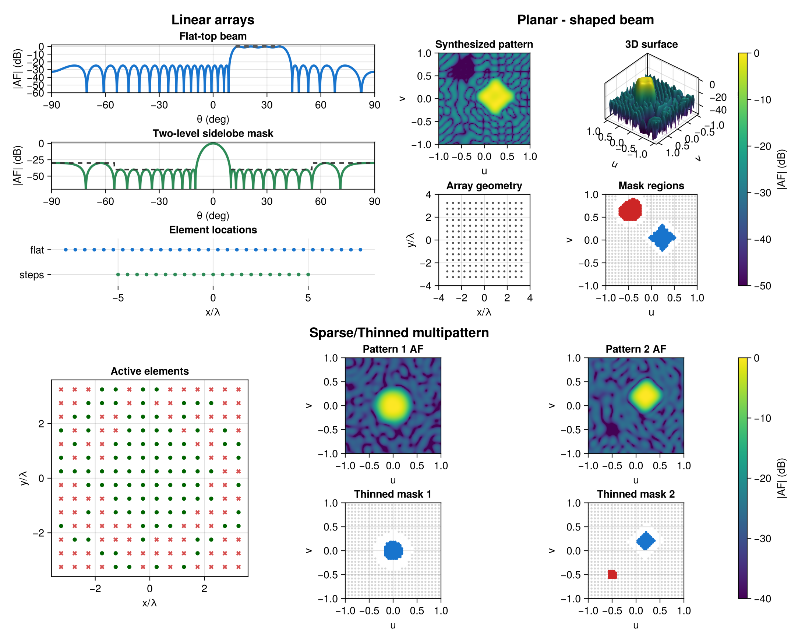

# ArraySynthesis.jl

A Julia package for antenna array factor synthesis via convex optimization.
Supports LP, QP, and SOCP formulations with multiple solvers through JuMP.



## Installation

```julia
pkg> add https://github.com/uvegege/ArraySynthesis.jl
```

## Quick start

```julia
using ArraySynthesis
using ArraySynthesis: °, dB
using HiGHS

beam_region = region(12.5°..37.5°, 1°)
sll_region1 = region(-90°..6.5°, 1°)
sll_region2 = region(43.5°..90°, 1°)

p   = pattern(shaped_beam(beam_region, 1.0, ripple = -0.6dB))
obj = MinSLL(join_regions(sll_region1, sll_region2))
array = symmetric_linear_array(32, d = 0.5)

result = synthesize(array, p, obj, ConjugateSymmetricWeights(), LP(), HiGHS.Optimizer)
```

## References

- H. Lebret and S. Boyd, "Antenna array pattern synthesis via convex optimization," *IEEE Trans. Signal Process.*, vol. 45, no. 3, pp. 526–532, Mar. 1997.
- B. Fuchs, "Shaped beam synthesis of arbitrary arrays via linear programming," *IEEE Antennas Wireless Propag. Lett.*, vol. 9, pp. 481–484, 2010.
