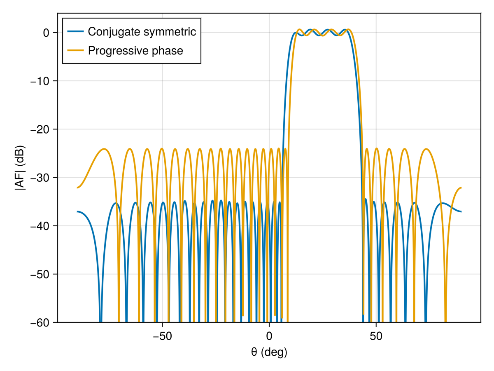

# Flat-top linear beam

This example synthesizes a flat-top beam on a symmetric linear array. The shaped
beam region fixes the main-lobe amplitude within a ripple tolerance, while
`MinSLL` minimizes the sidelobe level outside that sector.

````julia
using ArraySynthesis
using ArraySynthesis: °, dB
using GLMakie
using HiGHS
````

A symmetric array lets `ConjugateSymmetricWeights` produce a real array factor.
This makes the LP sidelobe constraints exact and linear.

````julia
array = symmetric_linear_array(32, d = 0.5)
````

The main beam is the flat sector. The sidelobe regions leave a guard band around
it so the transition is not constrained too tightly.

````julia
beam_region = region(ClosedInterval(12.5°, 37.5°), 1°)
sll_region1 = region(ClosedInterval(-90°, 6.5°), 1°)
sll_region2 = region(ClosedInterval(43.5°, 90°), 1°)
sll_region = join_regions(sll_region1, sll_region2)
````

`shaped_beam` adds bounded-ripple constraints in the main region. `MinSLL`
optimizes the peak sidelobe level over the sidelobe regions.

````julia
p = pattern(shaped_beam(beam_region, 1.0, ripple = -0.6dB))
obj = MinSLL(sll_region)

result_cplx = synthesize(array, p, obj, ConjugateSymmetricWeights(), LP(), HiGHS.Optimizer)
````

The same geometry can also be synthesized with a fixed progressive phase
reference. This is useful when the phase center is known a priori.

````julia
phase = ProgressivePhaseAmplitude(25°)
result_prog = synthesize(array, p, obj, phase, LP(), HiGHS.Optimizer)
````

Plot both solutions for comparison.

````julia
theta_vals = -π/2:0.001:π/2
af_cplx = 20 .* log10.(max.([abs(array_factor(array, ConjugateSymmetricWeights(), result_cplx.weights, [ThetaDirection(θ)])[1]) for θ in theta_vals], 1e-12))
af_prog = 20 .* log10.(max.([abs(array_factor(array, phase, result_prog.weights, [ThetaDirection(θ)])[1]) for θ in theta_vals], 1e-12))

fig = Figure()
ax = Axis(fig[1, 1], xlabel = "θ (deg)", ylabel = "|AF| (dB)")
lines!(ax, theta_vals ./ °, af_cplx, linewidth = 2, label = "Conjugate symmetric")
lines!(ax, theta_vals ./ °, af_prog, linewidth = 2, label = "Progressive phase")
ylims!(ax, -60, 4)
axislegend(ax, position = :lt)
fig
````

The documentation includes a precomputed result image, so this example is
shown without being executed by Documenter.



---

*This page was generated using [Literate.jl](https://github.com/fredrikekre/Literate.jl).*

