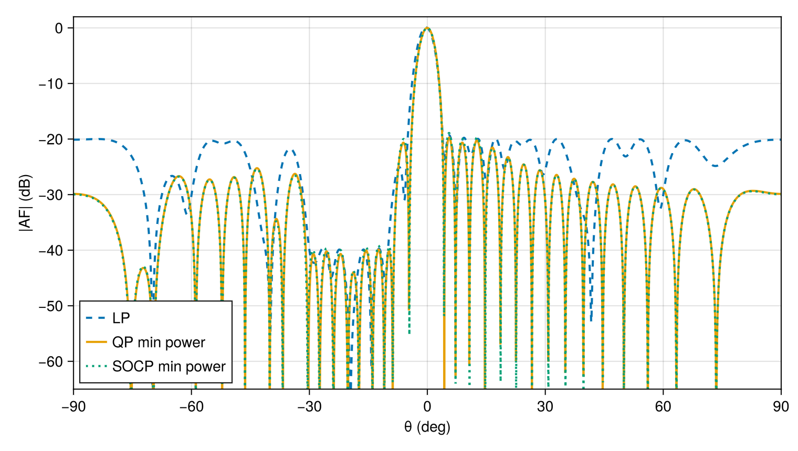

# Power and null constraints

This example uses a linear array with explicit nulls and a piecewise sidelobe
mask. The same specification is solved with LP, QP, and SOCP formulations to
show how the formulation changes the optimization problem while the array,
regions, and coefficient type stay fixed.

````julia
using ArraySynthesis
using ArraySynthesis: °, dB
using GLMakie
using Mosek, MosekTools

array = uniform_linear_array(32, d = 0.5)
coef = ComplexWeights()
````

The sidelobe mask is split into angular intervals. This makes it possible to
combine broad -20 dB regions with deeper -40 dB protected regions.

````julia
sll_region1 = region(ClosedInterval(-90°, -69°), 1°)
sll_region2 = region(ClosedInterval(-71°, -41°), 1°)
sll_region3 = region(ClosedInterval(-39°, -30°), 1°)
sll_region4 = region(ClosedInterval(-30°, -21°), 1°)
sll_region5 = region(ClosedInterval(-19°, -10°), 1°)
sll_region6 = region(ClosedInterval(-10°, -5°), 1°)
sll_region7 = region(ClosedInterval(5°, 90°), 1°)

p = pattern(
    beam(0°),
    sidelobes(sll_region1, -20dB),
    sidelobes(sll_region2, -20dB),
    sidelobes(sll_region3, -20dB),
    sidelobes(sll_region4, -40dB),
    sidelobes(sll_region5, -40dB),
    sidelobes(sll_region6, -20dB),
    sidelobes(sll_region7, -20dB),
    null(-70°, level = -55dB),
    null(-40°, level = -55dB),
    null(-20°, level = -55dB),
)
````

`MinL1` gives an LP reference solution. `MinPower` adds an explicit quadratic
objective; with `SOCP`, the same power objective is expressed through
second-order cone constraints.

````julia
result_lp = synthesize(array, p, MinL1(1.2), coef, LP(), Mosek.Optimizer)
result_qp = synthesize(array, p, MinPower(), coef, QP(), Mosek.Optimizer)
result_socp = synthesize(array, p, MinPower(), coef, SOCP(), Mosek.Optimizer)

theta_vals = -π / 2:0.001:π / 2
af_lp = 20 .* log10.(max.([abs(array_factor(array, coef, result_lp.weights, [ThetaDirection(θ)])[1]) for θ in theta_vals], 1e-12))
af_qp = 20 .* log10.(max.([abs(array_factor(array, coef, result_qp.weights, [ThetaDirection(θ)])[1]) for θ in theta_vals], 1e-12))
af_socp = 20 .* log10.(max.([abs(array_factor(array, coef, result_socp.weights, [ThetaDirection(θ)])[1]) for θ in theta_vals], 1e-12))

fig = Figure(size = (760, 430))
ax = Axis(fig[1, 1], xlabel = "θ (deg)", ylabel = "|AF| (dB)")
lines!(ax, theta_vals ./ °, af_lp, linewidth = 2, label = "LP min L1", linestyle = :dash)
lines!(ax, theta_vals ./ °, af_qp, linewidth = 2, label = "QP min power")
lines!(ax, theta_vals ./ °, af_socp, linewidth = 2, label = "SOCP min power", linestyle = :dot)
ylims!(ax, -65, 2)
xlims!(ax, -90, 90)
axislegend(ax, position = :lb)
fig
````



---

*This page was generated using [Literate.jl](https://github.com/fredrikekre/Literate.jl).*

