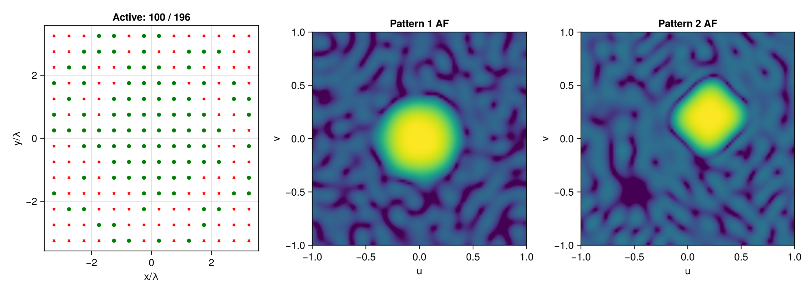

# Sparse multipattern array

This example synthesizes two different planar patterns using a shared active
element support. Each pattern has its own optimized weights, but
`MultiPatternReweightedL1` promotes the same physical elements being active.

````julia
using ArraySynthesis
using ArraySynthesis: °, dB
using GLMakie
using Mosek, MosekTools

array = planar_array(14, 14, dx = 0.5, dy = 0.5)
````

Pattern 1 is a broadside circular shaped beam.

````julia
beam_region1 = region(ArraySynthesis.Circle(0.2, (0.0, 0.0)), step = 2°)
sl_region1 = visible_region(ArraySynthesis.Circle(0.4, (0.0, 0.0)); step = 4°, bandpass = 0.0, filtered = false)
p1 = pattern(
    shaped_beam(beam_region1, 1.0, ripple = -1dB),
    sidelobes(sl_region1, -25.85dB),
)
````

Pattern 2 is an offset rhombus beam with an additional null.

````julia
beam_shape2 = rhombus((0.2, 0.2), 0.2)
guard_shape2 = rhombus((0.2, 0.2), 0.4)
beam_region2 = region(beam_shape2, step = 2°)
sl_region2 = visible_region(guard_shape2, ArraySynthesis.Circle(0.1, (-0.5, -0.5)); step = 4°, bandpass = 0.0, filtered = false)
null_region2 = region(ArraySynthesis.Circle(0.1, (-0.5, -0.5)), step = 2°)
p2 = pattern(
    shaped_beam(beam_region2, 1.0, ripple = -1dB),
    sidelobes(sl_region2, -24.30dB),
    sidelobes(null_region2, -50dB),
)

obj = MultiPatternReweightedL1(max_iter = 15)
coef = ComplexWeights()
result = synthesize(array, [p1, p2], obj, coef, LP(), Mosek.Optimizer)
````

An element is active if it is used by any pattern.

````julia
max_activity = [maximum(abs(result.weights[k][n]) for k in eachindex(result.weights)) for n in eachindex(result.weights[1])]
active = max_activity .> 1e-5


function normalized_db(values; floor = 1e-12)
    mag = abs.(values)
    mag ./= maximum(mag)
    return 20 .* log10.(max.(mag, floor))
end

U = collect(-1.0:0.025:1.0)
V = collect(-1.0:0.025:1.0)
dirs = [UVDirection(u, v) for u in U, v in V]
patterns_db = [
    begin
        af_db = reshape(normalized_db(array_factor(array, coef, result.weights[k], dirs)), length(U), length(V))
        max.(af_db, -45.0)
    end for k in eachindex(result.weights)
]

af_pattern1 = patterns_db[1]
af_pattern2 = patterns_db[2]
fig = Figure()
ax1 = Axis(fig[1, 1], xlabel = "x/λ", ylabel = "y/λ", title = "Active: $(sum(active)) / $(length(active))")
scatter!(ax1, array.positions[1, .!active], array.positions[2, .!active], color = :red, marker = :x, markersize = 6)
scatter!(ax1, array.positions[1, active], array.positions[2, active], color = :green, markersize = 8)
ax2 = Axis(fig[1, 2], xlabel = "u", ylabel = "v", title = "Pattern 1 AF", aspect = DataAspect())
image!(ax2, (-1, 1), (-1, 1), af_pattern1, colorrange = (-40, 0), colormap = :viridis)
ax3 = Axis(fig[1, 3], xlabel = "u", ylabel = "v", title = "Pattern 2 AF", aspect = DataAspect())
image!(ax3, (-1, 1), (-1, 1), af_pattern2, colorrange = (-40, 0), colormap = :viridis)
fig
````

The documentation includes a precomputed result image, so this example is
shown without being executed by Documenter.



---

*This page was generated using [Literate.jl](https://github.com/fredrikekre/Literate.jl).*

